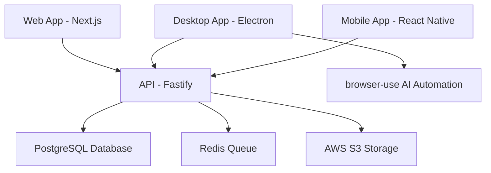

# JobSwipe: Enterprise Job Application Automation Platform

<div align="center">


**AI-Powered Job Application Automation with Enterprise Security**

[](LICENSE)
[](https://nodejs.org/)
[](https://www.typescriptlang.org/)
[](https://nextjs.org/)
[](https://www.electronjs.org/)

</div>

## 🎯 Overview

JobSwipe is an enterprise-grade job application automation platform that combines modern web technologies with AI-powered browser automation. Users swipe right on jobs through an intuitive web interface, while the desktop application automatically applies to selected positions using advanced browser automation.

### Key Features

- 🎨 **Intuitive Web Interface**: Tinder-like job browsing experience
- 🤖 **AI-Powered Automation**: Intelligent form filling and application submission
- 🔒 **Enterprise Security**: GDPR compliance, encryption, and audit logging
- 📱 **Multi-Platform**: Web, desktop, and mobile (future) applications
- ⚡ **High Performance**: Built for millions of users and applications
- 🚀 **Scalable Architecture**: Microservices-ready monorepo structure

## 🏛️ Architecture

### System Components



### Technology Stack

| Component | Technology | Purpose |
|-----------|------------|---------|
| **Web Frontend** | Next.js 15 + TypeScript | Job browsing interface |
| **Desktop App** | Electron + React | Browser automation |
| **Backend API** | Fastify + TypeScript | Business logic & APIs |
| **Database** | PostgreSQL + Prisma | Data persistence |
| **Queue System** | BullMQ + Redis | Background jobs |
| **File Storage** | AWS S3 | Resume & document storage |
| **Automation** | browser-use + Playwright | AI job application |

## 🚀 Quick Start

### Prerequisites

- **Node.js**: ≥20.0.0
- **npm**: ≥10.0.0
- **Docker**: Latest version
- **PostgreSQL**: 16+ (or use Docker)
- **Redis**: 7+ (or use Docker)

### Development Setup

1. **Clone the repository**
   ```bash
   git clone https://github.com/Abransh/jobswipe.git
   cd jobswipe
   ```

2. **Install dependencies**
   ```bash
   npm install
   ```

3. **Set up environment variables**
   ```bash
   cp .env.example .env.local
   # Edit .env.local with your configuration
   ```

4. **Start development services**
   ```bash
   # Start PostgreSQL, Redis, and other services
   npm run docker:dev
   ```

5. **Run database migrations**
   ```bash
   npm run db:migrate
   ```

6. **Start all applications**
   ```bash
   npm run dev
   ```

### Available Applications

- **Web App**: http://localhost:3000
- **API Server**: http://localhost:3001
- **Desktop App**: Electron window opens automatically
- **Database GUI**: http://localhost:8080 (PgAdmin)
- **Redis GUI**: http://localhost:8081 (Redis Commander)

## 📁 Project Structure

```
jobswipe/
├── apps/                           # Applications
│   ├── web/                        # Next.js web application
│   ├── desktop/                    # Electron desktop app
│   ├── api/                        # Fastify backend API
│   └── mobile/                     # React Native (future)
├── packages/                       # Shared packages
│   ├── types/                      # TypeScript type definitions
│   ├── utils/                      # Shared utilities
│   ├── config/                     # Configuration
│   ├── database/                   # Prisma schema & migrations
│   └── ui/                         # Shared UI components
├── browser-use/                    # AI browser automation library
├── docs/                           # Documentation
├── scripts/                        # Development scripts
├── infrastructure/                 # AWS CDK infrastructure
└── .github/workflows/              # CI/CD pipelines
```

## 🛠️ Development

### Available Scripts

```bash
# Development
npm run dev                         # Start all apps in development
npm run dev:web                     # Start web app only
npm run dev:desktop                 # Start desktop app only
npm run dev:api                     # Start API server only

# Building
npm run build                       # Build all applications
npm run build:web                   # Build web app
npm run build:desktop               # Build desktop app
npm run build:api                   # Build API server

# Testing
npm run test                        # Run all tests
npm run test:unit                   # Run unit tests
npm run test:e2e                    # Run end-to-end tests
npm run test:integration            # Run integration tests

# Database
npm run db:migrate                  # Run database migrations
npm run db:seed                     # Seed development data
npm run db:studio                   # Open Prisma Studio
npm run db:reset                    # Reset database

# Code Quality
npm run lint                        # Lint all code
npm run lint:fix                    # Fix linting issues
npm run type-check                  # TypeScript type checking
npm run format                      # Format code with Prettier

# Security
npm run security:audit              # Security audit
npm run security:scan               # Security vulnerability scan
```

### Development Workflow

1. **Feature Development**
   ```bash
   git checkout -b feature/your-feature-name
   npm run dev
   # Make your changes
   npm run test
   npm run lint
   git commit -m "feat: your feature description"
   ```

2. **Testing**
   ```bash
   npm run test:unit                # Fast unit tests
   npm run test:integration         # API integration tests
   npm run test:e2e                 # End-to-end user flows
   ```

3. **Code Quality**
   ```bash
   npm run lint:fix                 # Fix linting issues
   npm run type-check               # Ensure type safety
   npm run format                   # Format code
   ```

## 🔒 Security

### Security Features

- **Authentication**: JWT with refresh tokens
- **Authorization**: Role-based access control (RBAC)
- **Data Encryption**: AES-256 for sensitive data
- **Input Validation**: Zod schema validation
- **Rate Limiting**: Redis-based sliding window
- **File Upload Security**: Virus scanning and type validation
- **Audit Logging**: Complete audit trail for sensitive operations

### Compliance

- **GDPR**: Data portability, right to deletion, consent management
- **Security Headers**: HSTS, CSP, X-Frame-Options
- **Data Retention**: Automated data lifecycle management
- **Privacy**: Anonymous analytics, IP anonymization

## 🤖 Browser Automation

### How It Works

1. **User Action**: User swipes right on a job in the web interface
2. **Queue Creation**: Application task is added to the BullMQ queue
3. **Desktop Processing**: Desktop app picks up the task
4. **AI Automation**: browser-use library navigates and fills forms
5. **Captcha Handling**: Switches to headful mode when needed
6. **Status Updates**: Real-time updates back to the user

### Automation Features

- **Smart Form Filling**: AI understands form context
- **Multi-Site Support**: Works with major job boards
- **Captcha Detection**: Automatic fallback to human interaction
- **Rate Limiting**: Respects site rate limits
- **Error Recovery**: Robust error handling and retry logic

## 📊 Monitoring & Analytics

### Application Monitoring

- **Performance**: DataDog APM for request tracing
- **Errors**: Sentry for error tracking and alerting
- **Metrics**: Custom business metrics dashboard
- **Health Checks**: Automated health monitoring

### Business Analytics

- **User Behavior**: PostHog for privacy-first analytics
- **Application Success**: Track automation success rates
- **Performance Metrics**: Monitor system performance
- **A/B Testing**: Feature flag management

## 🚀 Deployment

### Production Requirements

- **Infrastructure**: AWS (ECS, RDS, ElastiCache, S3)
- **Monitoring**: DataDog, CloudWatch
- **CI/CD**: GitHub Actions
- **Security**: AWS WAF, GuardDuty
- **Backup**: Automated database backups

### Environment Setup

1. **Staging Environment**
   ```bash
   # Deploy to staging
   npm run deploy:staging
   ```

2. **Production Deployment**
   ```bash
   # Deploy to production
   npm run deploy:production
   ```

## 📖 Documentation

- **[API Documentation](./docs/api/README.md)** - Complete API reference
- **[Architecture Guide](./docs/architecture/README.md)** - System architecture
- **[Security Policy](./docs/security/README.md)** - Security guidelines
- **[Deployment Guide](./docs/deployment/README.md)** - Production deployment
- **[Contributing Guide](./CONTRIBUTING.md)** - Development guidelines

## 🤝 Contributing

We welcome contributions! Please see our [Contributing Guide](./CONTRIBUTING.md) for details.

### Development Guidelines

1. Follow TypeScript best practices
2. Write comprehensive tests
3. Maintain security standards
4. Update documentation
5. Follow commit message conventions

## 📄 License

This project is proprietary and confidential. Unauthorized copying, distribution, or use is strictly prohibited.

## 🆘 Support

- **Documentation**: [docs/](./docs/)
- **Issues**: [GitHub Issues](https://github.com/your-org/jobswipe/issues)
- **Email**: support@jobswipe.com
- **Discord**: [Community Discord](https://discord.gg/jobswipe)

## 🙏 Acknowledgments

- **browser-use**: AI browser automation library
- **Next.js**: React framework for production
- **Electron**: Cross-platform desktop apps
- **Fastify**: Fast and low overhead web framework
- **Prisma**: Next-generation ORM

---

<div align="center">
  <p>Built with ❤️ by the JobSwipe Team</p>
  <p>Enterprise Job Application Automation Platform</p>
</div>