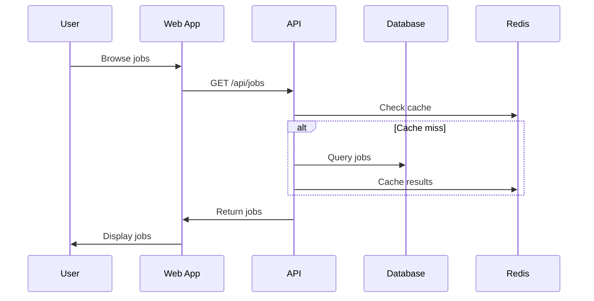
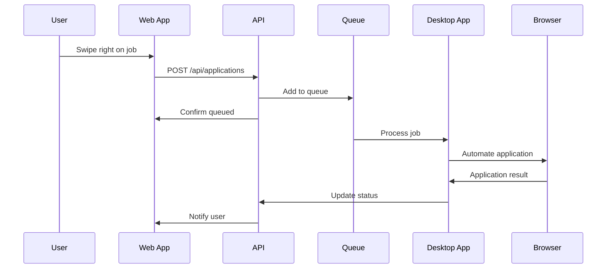
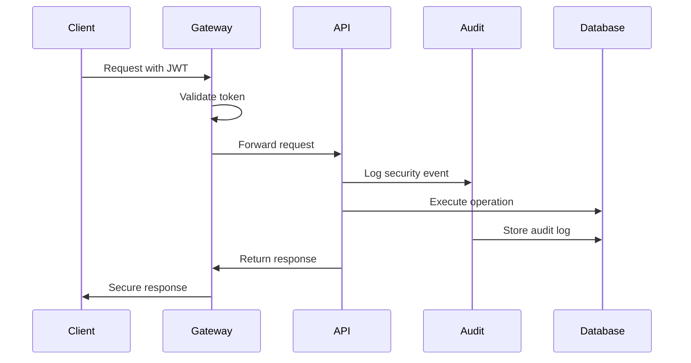

# JobSwipe Architecture Guide

## 🏛️ System Architecture Overview

JobSwipe is built as an enterprise-grade monorepo using modern microservices patterns. The architecture is designed for scalability, maintainability, and security.

## 🎯 Architecture Principles

### 1. **Domain-Driven Design (DDD)**
- Clear bounded contexts for different business domains
- Domain models that reflect business logic
- Separation of concerns across domains

### 2. **Event-Driven Architecture**
- Asynchronous communication between services
- Event sourcing for audit trails
- Pub/sub patterns for loose coupling

### 3. **Security by Design**
- Zero-trust security model
- Defense in depth
- Encryption at rest and in transit

### 4. **Cloud-Native**
- Container-first approach
- Stateless services
- Auto-scaling capabilities

## 🏗️ System Components

### Frontend Layer

#### Web Application (Next.js 15)
```typescript
// Component Structure
src/
├── app/                    # Next.js App Router
│   ├── (auth)/            # Authentication routes
│   ├── dashboard/         # User dashboard
│   ├── jobs/              # Job browsing
│   └── api/               # API routes
├── components/            # Reusable UI components
├── hooks/                 # Custom React hooks
├── lib/                   # Utilities and API clients
└── stores/                # State management (Zustand)
```

**Key Features:**
- Server-Side Rendering (SSR) for SEO
- Progressive Web App (PWA) capabilities
- Responsive design with Tailwind CSS
- Real-time updates with WebSockets

#### Desktop Application (Electron)
```typescript
// Desktop App Structure
src/
├── main/                  # Main process
│   ├── automation/        # Browser automation logic
│   ├── queue/             # Job queue management
│   └── security/          # Security utilities
├── renderer/              # Renderer process (React)
│   ├── components/        # UI components
│   ├── hooks/             # React hooks
│   └── stores/            # State management
└── preload/               # Preload scripts
```

**Key Features:**
- browser-use integration for AI automation
- Secure IPC communication
- Auto-updates with code signing
- System tray integration

### Backend Layer

#### API Server (Fastify + TypeScript)
```typescript
// API Structure
src/
├── controllers/           # Route handlers
├── services/              # Business logic
├── middleware/            # Custom middleware
├── models/                # Data models (Prisma)
├── routes/                # API route definitions
├── validators/            # Zod validation schemas
├── utils/                 # Utility functions
└── config/                # Configuration
```

**Key Features:**
- High-performance async/await
- OpenAPI/Swagger documentation
- Rate limiting and security middleware
- Comprehensive error handling

### Data Layer

#### PostgreSQL Database
```sql
-- Core Schema Structure
users                      -- User accounts
user_profiles             -- Extended profile data
jobs                      -- Job postings
job_applications          -- Application records
application_queue         -- Processing queue
user_job_swipes          -- Swipe interactions
resumes                   -- Resume storage metadata
audit_logs               -- Security audit trail
```

**Key Features:**
- ACID compliance for data integrity
- Row-level security (RLS)
- Full-text search capabilities
- Automated backups and point-in-time recovery

#### Redis Cache & Queue
```typescript
// Redis Usage Patterns
interface RedisStructure {
  cache: {
    user_sessions: string;     // User session data
    job_data: Hash;            // Cached job information
    rate_limits: Counter;      // Rate limiting counters
  };
  queues: {
    application_queue: Queue;  // Job application tasks
    email_queue: Queue;        // Email notifications
    analytics_queue: Queue;    // Analytics events
  };
}
```

## 🔄 Data Flow Architecture

### 1. Job Browsing Flow


### 2. Application Automation Flow


### 3. Security & Audit Flow


## 🏗️ Microservices Architecture

### Service Boundaries

#### 1. User Management Service
- **Responsibility**: Authentication, authorization, user profiles
- **Database**: Users, user_profiles, user_sessions
- **APIs**: /auth, /users, /profiles

#### 2. Job Management Service
- **Responsibility**: Job data, search, recommendations
- **Database**: Jobs, job_categories, job_search_history
- **APIs**: /jobs, /search, /recommendations

#### 3. Application Service
- **Responsibility**: Application processing, automation
- **Database**: Applications, application_queue, automation_logs
- **APIs**: /applications, /automation

#### 4. File Storage Service
- **Responsibility**: Resume uploads, document management
- **Storage**: AWS S3
- **APIs**: /files, /resumes, /documents

### Inter-Service Communication

#### Synchronous Communication (REST APIs)
```typescript
// Service-to-service API calls
class UserService {
  async getUser(id: string): Promise<User> {
    return await this.httpClient.get(`/users/${id}`);
  }
}

class JobService {
  async getUserRecommendations(userId: string): Promise<Job[]> {
    const user = await this.userService.getUser(userId);
    return this.generateRecommendations(user);
  }
}
```

#### Asynchronous Communication (Events)
```typescript
// Event-driven communication
interface DomainEvents {
  'user.registered': { userId: string; email: string };
  'job.applied': { userId: string; jobId: string; status: string };
  'application.completed': { applicationId: string; success: boolean };
}

// Event publishers
class ApplicationService {
  async completeApplication(id: string, success: boolean) {
    // Update application status
    await this.updateStatus(id, success ? 'completed' : 'failed');
    
    // Publish event
    await this.eventBus.publish('application.completed', {
      applicationId: id,
      success
    });
  }
}
```

## 🔒 Security Architecture

### Authentication & Authorization

#### JWT Token Strategy
```typescript
// Token structure
interface JWTPayload {
  sub: string;          // User ID
  email: string;        // User email
  roles: string[];      // User roles
  permissions: string[]; // Granular permissions
  iat: number;          // Issued at
  exp: number;          // Expires at
}

// Authorization middleware
async function authorize(requiredPermissions: string[]) {
  return async (request: FastifyRequest, reply: FastifyReply) => {
    const token = extractToken(request.headers.authorization);
    const payload = await verifyToken(token);
    
    if (!hasPermissions(payload.permissions, requiredPermissions)) {
      throw new UnauthorizedError('Insufficient permissions');
    }
    
    request.user = payload;
  };
}
```

### Data Protection

#### Encryption at Rest
```typescript
// Sensitive data encryption
class EncryptionService {
  encrypt(plaintext: string): string {
    const algorithm = 'aes-256-gcm';
    const key = Buffer.from(process.env.ENCRYPTION_KEY!, 'hex');
    const iv = crypto.randomBytes(16);
    
    const cipher = crypto.createCipher(algorithm, key, iv);
    let encrypted = cipher.update(plaintext, 'utf8', 'hex');
    encrypted += cipher.final('hex');
    
    const authTag = cipher.getAuthTag();
    return `${iv.toString('hex')}:${authTag.toString('hex')}:${encrypted}`;
  }
}
```

#### Input Validation
```typescript
// Zod validation schemas
const JobApplicationSchema = z.object({
  jobId: z.string().uuid(),
  resumeId: z.string().uuid(),
  coverLetter: z.string().max(2000).optional(),
  customFields: z.record(z.string().max(500))
});

// Route validation
app.post('/applications', {
  schema: {
    body: JobApplicationSchema
  }
}, async (request, reply) => {
  // Request body is automatically validated
  const application = await createApplication(request.body);
  reply.send(application);
});
```

## 📊 Performance Architecture

### Caching Strategy

#### Multi-Level Caching
```typescript
// Caching hierarchy
class CacheService {
  // L1: Application cache (in-memory)
  private l1Cache = new Map<string, any>();
  
  // L2: Redis cache (distributed)
  private l2Cache: Redis;
  
  // L3: Database (persistent)
  private database: Database;
  
  async get<T>(key: string): Promise<T | null> {
    // Check L1 cache
    if (this.l1Cache.has(key)) {
      return this.l1Cache.get(key);
    }
    
    // Check L2 cache
    const l2Value = await this.l2Cache.get(key);
    if (l2Value) {
      this.l1Cache.set(key, l2Value);
      return JSON.parse(l2Value);
    }
    
    // Check database
    const dbValue = await this.database.get(key);
    if (dbValue) {
      this.l1Cache.set(key, dbValue);
      await this.l2Cache.setex(key, 3600, JSON.stringify(dbValue));
      return dbValue;
    }
    
    return null;
  }
}
```

### Database Optimization

#### Query Optimization
```sql
-- Optimized queries with proper indexing
CREATE INDEX CONCURRENTLY idx_jobs_location_salary 
ON jobs (location, salary_min, salary_max) 
WHERE status = 'active';

CREATE INDEX CONCURRENTLY idx_applications_user_status 
ON applications (user_id, status, created_at);

-- Materialized views for complex queries
CREATE MATERIALIZED VIEW job_recommendations AS
SELECT 
  u.id as user_id,
  j.id as job_id,
  SIMILARITY(u.skills, j.required_skills) as match_score
FROM users u
CROSS JOIN jobs j
WHERE j.status = 'active'
  AND SIMILARITY(u.skills, j.required_skills) > 0.5;
```

## 🔄 Scalability Architecture

### Horizontal Scaling

#### Load Balancing
```typescript
// Health check endpoint
app.get('/health', async (request, reply) => {
  const checks = await Promise.allSettled([
    checkDatabase(),
    checkRedis(),
    checkS3(),
    checkQueue()
  ]);
  
  const isHealthy = checks.every(
    check => check.status === 'fulfilled'
  );
  
  reply.code(isHealthy ? 200 : 503).send({
    status: isHealthy ? 'healthy' : 'unhealthy',
    timestamp: new Date().toISOString(),
    checks: checks.map(check => ({
      status: check.status,
      value: check.status === 'fulfilled' ? check.value : check.reason
    }))
  });
});
```

#### Auto-Scaling Configuration
```yaml
# AWS ECS Auto Scaling
resource "aws_appautoscaling_target" "api_target" {
  max_capacity       = 100
  min_capacity       = 2
  resource_id        = "service/jobswipe-cluster/jobswipe-api"
  scalable_dimension = "ecs:service:DesiredCount"
  service_namespace  = "ecs"
}

resource "aws_appautoscaling_policy" "api_up" {
  name               = "jobswipe-api-scale-up"
  policy_type        = "TargetTrackingScaling"
  resource_id        = aws_appautoscaling_target.api_target.resource_id
  scalable_dimension = aws_appautoscaling_target.api_target.scalable_dimension
  service_namespace  = aws_appautoscaling_target.api_target.service_namespace

  target_tracking_scaling_policy_configuration {
    predefined_metric_specification {
      predefined_metric_type = "ECSServiceAverageCPUUtilization"
    }
    target_value = 70.0
  }
}
```

## 📈 Monitoring Architecture

### Observability Stack

#### Application Performance Monitoring
```typescript
// DataDog APM integration
import tracer from 'dd-trace';
tracer.init({
  service: 'jobswipe-api',
  env: process.env.NODE_ENV,
  version: process.env.APP_VERSION
});

// Custom metrics
import { StatsD } from 'node-statsd';
const metrics = new StatsD();

class MetricsService {
  static trackApplicationSuccess(success: boolean) {
    metrics.increment('applications.completed', 1, {
      success: success.toString()
    });
  }
  
  static trackAPILatency(endpoint: string, duration: number) {
    metrics.histogram('api.request.duration', duration, {
      endpoint
    });
  }
}
```

#### Business Metrics Dashboard
```typescript
// Custom business metrics
interface BusinessMetrics {
  dailyActiveUsers: number;
  applicationSuccessRate: number;
  averageTimeToApplication: number;
  revenuePerUser: number;
  churnRate: number;
}

class AnalyticsService {
  async calculateBusinessMetrics(): Promise<BusinessMetrics> {
    const [dau, successRate, avgTime, revenue, churn] = await Promise.all([
      this.getDailyActiveUsers(),
      this.getApplicationSuccessRate(),
      this.getAverageApplicationTime(),
      this.getRevenuePerUser(),
      this.getChurnRate()
    ]);
    
    return { dau, successRate, avgTime, revenue, churn };
  }
}
```

## 🚀 Deployment Architecture

### Infrastructure as Code

#### AWS CDK Stack
```typescript
// Infrastructure definition
export class JobSwipeStack extends cdk.Stack {
  constructor(scope: Construct, id: string, props?: cdk.StackProps) {
    super(scope, id, props);

    // VPC for network isolation
    const vpc = new ec2.Vpc(this, 'JobSwipeVPC', {
      maxAzs: 3,
      natGateways: 2
    });

    // ECS Cluster
    const cluster = new ecs.Cluster(this, 'JobSwipeCluster', {
      vpc,
      containerInsights: true
    });

    // RDS Database
    const database = new rds.DatabaseInstance(this, 'JobSwipeDB', {
      engine: rds.DatabaseInstanceEngine.postgres({
        version: rds.PostgresEngineVersion.VER_16
      }),
      instanceType: ec2.InstanceType.of(
        ec2.InstanceClass.R6G, 
        ec2.InstanceSize.LARGE
      ),
      vpc,
      multiAz: true,
      backupRetention: cdk.Duration.days(30)
    });
  }
}
```

### CI/CD Pipeline

#### GitHub Actions Workflow
```yaml
name: Deploy Production
on:
  push:
    branches: [main]

jobs:
  test:
    runs-on: ubuntu-latest
    steps:
      - uses: actions/checkout@v4
      - uses: actions/setup-node@v4
        with:
          node-version: '20'
          cache: 'npm'
      
      - run: npm ci
      - run: npm run test:unit
      - run: npm run test:integration
      - run: npm run security:audit

  deploy:
    needs: test
    runs-on: ubuntu-latest
    if: github.ref == 'refs/heads/main'
    steps:
      - run: aws ecs update-service --force-new-deployment
```

## 📋 Architecture Decision Records (ADRs)

### ADR-001: Database Choice (PostgreSQL)
**Status**: Accepted
**Context**: Need reliable, ACID-compliant database with JSON support
**Decision**: Use PostgreSQL 16 with Prisma ORM
**Consequences**: Strong consistency, excellent tooling, high performance

### ADR-002: Monorepo Structure
**Status**: Accepted  
**Context**: Multiple applications sharing code and types
**Decision**: Use npm workspaces with Turbo for build orchestration
**Consequences**: Better code sharing, consistent tooling, complex setup

### ADR-003: Browser Automation
**Status**: Accepted
**Context**: Need reliable, AI-powered form filling
**Decision**: Use browser-use library with Playwright backend
**Consequences**: Advanced AI capabilities, dependency on external library

## 🔧 Development Guidelines

### Code Organization
- Follow domain-driven design principles
- Use dependency injection for testability
- Implement interface segregation
- Maintain clear separation of concerns

### Testing Strategy
- Unit tests for business logic (80%+ coverage)
- Integration tests for API endpoints
- E2E tests for critical user journeys
- Performance tests for scalability validation

### Security Guidelines
- Never log sensitive data
- Validate all inputs with Zod schemas
- Use parameterized queries to prevent SQL injection
- Implement proper error handling without information leakage

---

This architecture is designed to scale from thousands to millions of users while maintaining security, performance, and reliability standards required for enterprise applications.