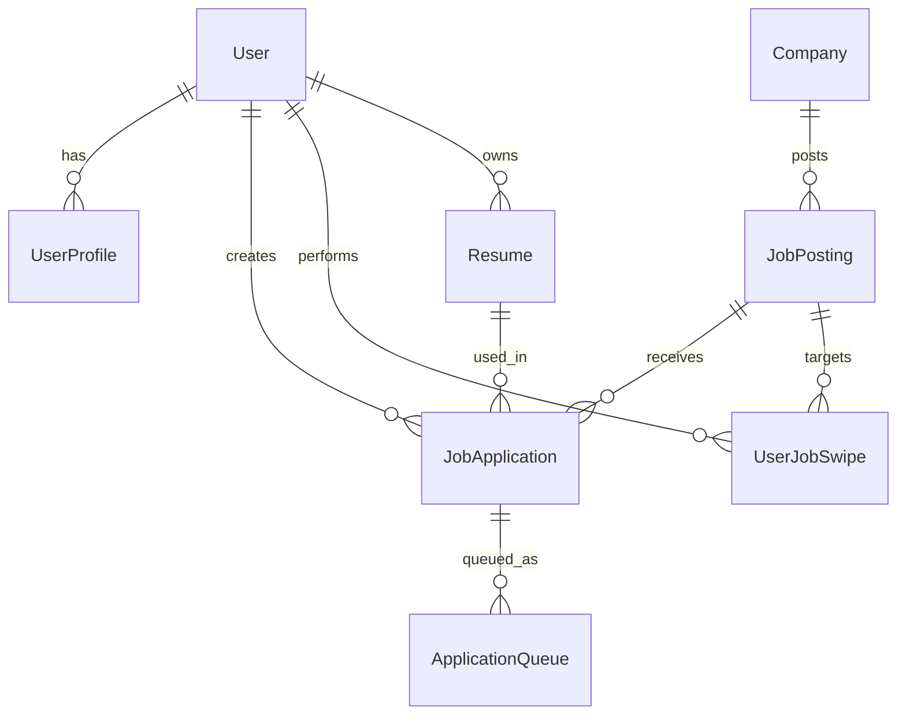

# JobSwipe Database Architecture Documentation

## 🎯 Overview

This document provides comprehensive documentation for the JobSwipe enterprise database schema. The database is designed to support millions of users with enterprise-grade security, GDPR compliance, and high-performance operations.

## 🏗️ Architecture Principles

### **Enterprise Standards Applied**
- **ACID Compliance**: PostgreSQL ensures data integrity
- **Scalability**: Optimized for horizontal scaling
- **Security**: Row-level security, encryption, audit trails
- **GDPR Compliance**: Data retention, consent management, right to deletion
- **Performance**: Strategic indexing, full-text search capabilities

### **Design Patterns Used**
- **Domain-Driven Design**: Clear bounded contexts
- **Event Sourcing**: Complete audit trail of all actions
- **CQRS Ready**: Optimized for read/write separation
- **Soft Deletes**: GDPR-compliant data retention
- **Optimistic Locking**: Concurrent update handling

## 📊 Database Schema Overview

### **Core Domain Models**



## 🔐 Security & Compliance Models

### **User Management & Authentication**

#### **User Model**
```sql
-- Enterprise user management with security features
CREATE TABLE users (
  id UUID PRIMARY KEY DEFAULT gen_random_uuid(),
  email VARCHAR(255) UNIQUE NOT NULL,
  password_hash VARCHAR(255),
  role user_role DEFAULT 'USER',
  status user_status DEFAULT 'ACTIVE',
  
  -- Security tracking
  last_login_at TIMESTAMP,
  login_attempts INTEGER DEFAULT 0,
  locked_until TIMESTAMP,
  
  -- GDPR compliance
  data_consent BOOLEAN DEFAULT false,
  consent_date TIMESTAMP,
  data_retention_until TIMESTAMP,
  is_deleted BOOLEAN DEFAULT false,
  deleted_at TIMESTAMP
);
```

**Security Features:**
- **Account Locking**: Automatic lockout after failed attempts
- **Role-Based Access**: USER, PREMIUM_USER, ADMIN, SUPER_ADMIN
- **Audit Trail**: All login attempts and security events logged
- **GDPR Ready**: Data consent tracking and automated deletion

#### **UserProfile Model**
```sql
-- Comprehensive user profile with privacy controls
CREATE TABLE user_profiles (
  id UUID PRIMARY KEY DEFAULT gen_random_uuid(),
  user_id UUID REFERENCES users(id) ON DELETE CASCADE,
  
  -- Personal information (encrypted)
  first_name VARCHAR(100),
  last_name VARCHAR(100),
  phone VARCHAR(20),
  date_of_birth DATE,
  
  -- Professional details
  current_title VARCHAR(200),
  years_of_experience INTEGER,
  skills TEXT[],
  
  -- Privacy settings
  profile_visibility profile_visibility DEFAULT 'PRIVATE',
  show_email BOOLEAN DEFAULT false
);
```

#### **UserPreferences Model**
```sql
-- Granular user preferences for personalization
CREATE TABLE user_preferences (
  id UUID PRIMARY KEY DEFAULT gen_random_uuid(),
  user_id UUID REFERENCES users(id) ON DELETE CASCADE,
  
  -- Job search preferences
  job_search_radius INTEGER DEFAULT 50,
  job_types TEXT[],
  remote_pref remote_preference DEFAULT 'NO_PREFERENCE',
  
  -- Automation preferences
  auto_apply_enabled BOOLEAN DEFAULT false,
  auto_apply_max_per_day INTEGER DEFAULT 5,
  
  -- Privacy & consent
  data_processing_consent BOOLEAN DEFAULT false,
  marketing_consent BOOLEAN DEFAULT false,
  analytics_consent BOOLEAN DEFAULT false
);
```

## 🎯 Core Business Logic Models

### **Job Swiping System (Tinder-like Functionality)**

#### **UserJobSwipe Model**
```sql
-- Core swiping functionality with analytics
CREATE TABLE user_job_swipes (
  id UUID PRIMARY KEY DEFAULT gen_random_uuid(),
  user_id UUID REFERENCES users(id) ON DELETE CASCADE,
  job_posting_id UUID REFERENCES job_postings(id) ON DELETE CASCADE,
  
  -- Swipe action
  direction swipe_direction NOT NULL, -- LEFT, RIGHT, SUPER_LIKE
  confidence REAL, -- AI confidence score (0-1)
  
  -- Context tracking
  device_type VARCHAR(50),
  session_id VARCHAR(255),
  position INTEGER, -- Position in swipe deck
  time_spent INTEGER, -- Seconds spent viewing
  
  -- Matching algorithm
  match_score REAL, -- Algorithm match score (0-100)
  match_factors JSONB, -- What contributed to match
  
  -- Feedback loop
  user_feedback TEXT,
  is_correct_match BOOLEAN, -- Later validation
  
  UNIQUE(user_id, job_posting_id)
);
```

**Key Features:**
- **Tinder-like Mechanics**: LEFT (reject), RIGHT (like), SUPER_LIKE
- **AI Integration**: Confidence scoring and match factors
- **Analytics Ready**: Position tracking, time spent, device context
- **Machine Learning**: Feedback loop for algorithm improvement

### **Company & Job Management**

#### **Company Model**
```sql
-- Enhanced company profiles with verification
CREATE TABLE companies (
  id UUID PRIMARY KEY DEFAULT gen_random_uuid(),
  name VARCHAR(255) NOT NULL,
  slug VARCHAR(255) UNIQUE NOT NULL,
  
  -- Company details
  size company_size,
  industry VARCHAR(100),
  founded_year INTEGER,
  employee_count INTEGER,
  
  -- Verification & quality
  is_verified BOOLEAN DEFAULT false,
  verified_at TIMESTAMP,
  quality_score REAL, -- Algorithm-calculated (0-100)
  
  -- Status management
  status company_status DEFAULT 'ACTIVE',
  is_blacklisted BOOLEAN DEFAULT false,
  blacklist_reason TEXT
);
```

#### **JobPosting Model**
```sql
-- Comprehensive job postings with analytics
CREATE TABLE job_postings (
  id UUID PRIMARY KEY DEFAULT gen_random_uuid(),
  company_id UUID REFERENCES companies(id) ON DELETE CASCADE,
  
  -- Job basics
  title VARCHAR(255) NOT NULL,
  description TEXT NOT NULL,
  type job_type DEFAULT 'FULL_TIME',
  level job_level DEFAULT 'MID',
  category job_category DEFAULT 'OTHER',
  
  -- Work arrangement
  remote BOOLEAN DEFAULT false,
  remote_type remote_type DEFAULT 'ONSITE',
  location VARCHAR(255),
  
  -- Compensation
  salary_min INTEGER,
  salary_max INTEGER,
  currency VARCHAR(3) DEFAULT 'USD',
  salary_type salary_type,
  
  -- External integration
  external_id VARCHAR(255), -- From job boards
  source job_source DEFAULT 'MANUAL',
  source_url TEXT,
  apply_url TEXT,
  
  -- Quality & verification
  quality_score REAL,
  is_verified BOOLEAN DEFAULT false,
  
  -- Analytics tracking
  view_count INTEGER DEFAULT 0,
  application_count INTEGER DEFAULT 0,
  right_swipe_count INTEGER DEFAULT 0,
  left_swipe_count INTEGER DEFAULT 0,
  
  -- Status
  status job_status DEFAULT 'ACTIVE',
  posted_at TIMESTAMP,
  expires_at TIMESTAMP
);
```

**Advanced Features:**
- **Multi-Source Integration**: Manual, LinkedIn, Indeed, etc.
- **Quality Scoring**: Algorithm-based quality assessment
- **Analytics Tracking**: View counts, swipe ratios, application rates
- **Location Intelligence**: Structured location data with coordinates

### **Resume Template & Enhancement System**

#### **ResumeTemplate Model**
```sql
-- AI-powered resume templates
CREATE TABLE resume_templates (
  id UUID PRIMARY KEY DEFAULT gen_random_uuid(),
  name VARCHAR(255) NOT NULL,
  category template_category DEFAULT 'GENERAL',
  
  -- Template structure
  content JSONB NOT NULL, -- Template structure
  sections JSONB, -- Available sections
  styling JSONB, -- Layout and styling
  
  -- Targeting
  industry VARCHAR(100),
  experience VARCHAR(50),
  job_types TEXT[],
  
  -- Quality & usage
  quality_score REAL,
  downloads INTEGER DEFAULT 0,
  ratings REAL, -- Average user rating
  usage_count INTEGER DEFAULT 0,
  success_rate REAL, -- Application success rate
  
  -- Access control
  is_active BOOLEAN DEFAULT true,
  is_premium BOOLEAN DEFAULT false,
  is_public BOOLEAN DEFAULT true
);
```

#### **Resume Model**
```sql
-- User resumes with AI enhancement
CREATE TABLE resumes (
  id UUID PRIMARY KEY DEFAULT gen_random_uuid(),
  user_id UUID REFERENCES users(id) ON DELETE CASCADE,
  template_id UUID REFERENCES resume_templates(id),
  
  -- Resume content
  name VARCHAR(255) NOT NULL,
  title VARCHAR(255), -- Professional title
  content JSONB NOT NULL, -- Complete resume data
  sections JSONB, -- Section-by-section content
  
  -- File generation
  pdf_url TEXT,
  docx_url TEXT,
  html_url TEXT,
  last_generated TIMESTAMP,
  
  -- Version control
  version INTEGER DEFAULT 1,
  parent_resume_id UUID, -- For versioning
  is_default BOOLEAN DEFAULT false,
  
  -- AI enhancement
  ai_enhanced BOOLEAN DEFAULT false,
  enhancement_data JSONB,
  
  -- Quality metrics
  completeness REAL, -- Completeness score (0-100)
  readability_score REAL, -- ATS readability
  keyword_match REAL, -- Keyword optimization score
  
  -- Privacy
  visibility resume_visibility DEFAULT 'PRIVATE',
  share_token VARCHAR(255) -- For public sharing
);
```

#### **ResumeEnhancement Model**
```sql
-- AI-powered resume enhancements
CREATE TABLE resume_enhancements (
  id UUID PRIMARY KEY DEFAULT gen_random_uuid(),
  resume_id UUID REFERENCES resumes(id) ON DELETE CASCADE,
  job_posting_id UUID REFERENCES job_postings(id), -- Job-specific enhancement
  
  -- Enhancement details
  type enhancement_type NOT NULL,
  description TEXT NOT NULL,
  
  -- Before/after content
  original_content JSONB NOT NULL,
  enhanced_content JSONB NOT NULL,
  changes JSONB, -- Specific changes made
  
  -- AI context
  ai_model VARCHAR(100),
  prompt TEXT,
  confidence REAL,
  
  -- Results tracking
  is_applied BOOLEAN DEFAULT false,
  improved_match REAL, -- Improvement in match score
  success_rate REAL -- Success rate after enhancement
);
```

## 🤖 Browser Automation System

### **ApplicationQueue Model**
```sql
-- Browser automation job queue
CREATE TABLE application_queue (
  id UUID PRIMARY KEY DEFAULT gen_random_uuid(),
  user_id UUID REFERENCES users(id) ON DELETE CASCADE,
  job_posting_id UUID REFERENCES job_postings(id) ON DELETE CASCADE,
  application_id UUID REFERENCES job_applications(id),
  
  -- Queue management
  status queue_status DEFAULT 'PENDING',
  priority queue_priority DEFAULT 'NORMAL',
  attempts INTEGER DEFAULT 0,
  max_attempts INTEGER DEFAULT 3,
  
  -- Scheduling
  scheduled_at TIMESTAMP,
  started_at TIMESTAMP,
  completed_at TIMESTAMP,
  next_retry_at TIMESTAMP,
  
  -- Automation configuration
  use_custom_resume BOOLEAN DEFAULT false,
  resume_id UUID,
  cover_letter TEXT,
  custom_fields JSONB,
  
  -- Browser automation
  automation_config JSONB,
  requires_captcha BOOLEAN DEFAULT false,
  captcha_solved BOOLEAN DEFAULT false,
  
  -- Results
  success BOOLEAN,
  error_message TEXT,
  error_type VARCHAR(100),
  response_data JSONB,
  
  -- Desktop app integration
  desktop_session_id VARCHAR(255)
);
```

### **AutomationLog Model**
```sql
-- Detailed automation execution logs
CREATE TABLE automation_logs (
  id UUID PRIMARY KEY DEFAULT gen_random_uuid(),
  queue_id UUID REFERENCES application_queue(id) ON DELETE CASCADE,
  
  -- Log details
  level log_level DEFAULT 'INFO',
  message TEXT NOT NULL,
  details JSONB,
  
  -- Browser context
  step VARCHAR(100), -- Which automation step
  element_selector TEXT, -- CSS selector
  action VARCHAR(50), -- click, type, wait, etc.
  
  -- Error tracking
  error_type VARCHAR(100),
  stack_trace TEXT,
  screenshot TEXT, -- Screenshot URL if error
  
  -- Performance
  execution_time INTEGER, -- Milliseconds
  memory_usage BIGINT, -- Bytes
  
  -- Context
  browser_info JSONB,
  page_url TEXT,
  
  created_at TIMESTAMP DEFAULT NOW()
);
```

## 📈 Application Tracking System

### **JobApplication Model**
```sql
-- Comprehensive application tracking
CREATE TABLE job_applications (
  id UUID PRIMARY KEY DEFAULT gen_random_uuid(),
  user_id UUID REFERENCES users(id) ON DELETE CASCADE,
  job_posting_id UUID REFERENCES job_postings(id) ON DELETE CASCADE,
  resume_id UUID REFERENCES resumes(id),
  
  -- Application management
  status application_status DEFAULT 'DRAFT',
  priority application_priority DEFAULT 'MEDIUM',
  source application_source DEFAULT 'MANUAL',
  
  -- Content
  cover_letter TEXT,
  custom_fields JSONB,
  notes TEXT,
  
  -- Timeline tracking
  applied_at TIMESTAMP,
  viewed_at TIMESTAMP, -- When employer viewed
  response_at TIMESTAMP,
  interview_at TIMESTAMP,
  follow_up_at TIMESTAMP,
  
  -- External integration
  external_id VARCHAR(255), -- ATS system ID
  ats_url TEXT,
  confirmation_number VARCHAR(255),
  
  -- Automation
  automation_status automation_status,
  automation_attempts INTEGER DEFAULT 0,
  automation_data JSONB,
  
  -- Communication tracking
  recruiter_name VARCHAR(255),
  recruiter_email VARCHAR(255),
  recruiter_phone VARCHAR(50),
  
  -- Metrics
  response_time INTEGER, -- Hours to response
  interview_count INTEGER DEFAULT 0,
  match_score REAL,
  
  UNIQUE(user_id, job_posting_id)
);
```

### **ApplicationInteraction Model**
```sql
-- Detailed interaction timeline
CREATE TABLE application_interactions (
  id UUID PRIMARY KEY DEFAULT gen_random_uuid(),
  application_id UUID REFERENCES job_applications(id) ON DELETE CASCADE,
  
  -- Interaction details
  type interaction_type NOT NULL,
  title VARCHAR(255) NOT NULL,
  description TEXT,
  outcome interaction_outcome,
  
  -- Contact information
  contact_person VARCHAR(255),
  contact_email VARCHAR(255),
  contact_phone VARCHAR(50),
  contact_role VARCHAR(100),
  
  -- Scheduling
  scheduled_at TIMESTAMP,
  started_at TIMESTAMP,
  completed_at TIMESTAMP,
  duration INTEGER, -- Minutes
  
  -- Content
  agenda TEXT,
  notes TEXT,
  feedback TEXT,
  next_steps TEXT,
  attachments JSONB,
  
  -- Follow-up
  requires_follow_up BOOLEAN DEFAULT false,
  follow_up_date TIMESTAMP,
  follow_up_completed BOOLEAN DEFAULT false
);
```

## 💰 Subscription & Billing System

### **Subscription Model**
```sql
-- Enterprise subscription management
CREATE TABLE subscriptions (
  id UUID PRIMARY KEY DEFAULT gen_random_uuid(),
  user_id UUID UNIQUE REFERENCES users(id) ON DELETE CASCADE,
  
  -- Plan details
  plan subscription_plan DEFAULT 'FREE',
  status subscription_status DEFAULT 'ACTIVE',
  
  -- Stripe integration
  stripe_customer_id VARCHAR(255),
  stripe_subscription_id VARCHAR(255),
  stripe_price_id VARCHAR(255),
  
  -- Billing cycle
  current_period_start TIMESTAMP,
  current_period_end TIMESTAMP,
  cancel_at_period_end BOOLEAN DEFAULT false,
  
  -- Trial management
  trial_start TIMESTAMP,
  trial_end TIMESTAMP,
  trial_used BOOLEAN DEFAULT false,
  
  -- Plan limits
  monthly_applications INTEGER,
  resume_templates INTEGER,
  priority_support BOOLEAN DEFAULT false,
  
  -- Billing tracking
  last_payment_at TIMESTAMP,
  last_payment_amount DECIMAL(10,2),
  next_billing_date TIMESTAMP
);
```

### **UsageRecord Model**
```sql
-- Granular usage tracking for billing
CREATE TABLE usage_records (
  id UUID PRIMARY KEY DEFAULT gen_random_uuid(),
  user_id UUID REFERENCES users(id) ON DELETE CASCADE,
  subscription_id UUID REFERENCES subscriptions(id),
  
  -- Usage details
  feature usage_feature NOT NULL,
  count INTEGER DEFAULT 1,
  metadata JSONB,
  
  -- Context
  session_id VARCHAR(255),
  device_type VARCHAR(50),
  ip_address INET,
  
  -- Time tracking
  date DATE DEFAULT CURRENT_DATE,
  hour INTEGER, -- 0-23
  created_at TIMESTAMP DEFAULT NOW(),
  
  UNIQUE(user_id, feature, date)
);
```

## 🔒 Enterprise Security & Audit

### **AuditLog Model**
```sql
-- Comprehensive audit trail
CREATE TABLE audit_logs (
  id UUID PRIMARY KEY DEFAULT gen_random_uuid(),
  
  -- Actor information
  user_id UUID REFERENCES users(id),
  actor_type actor_type DEFAULT 'USER',
  actor_id VARCHAR(255),
  
  -- Action details
  action VARCHAR(255) NOT NULL,
  resource VARCHAR(255) NOT NULL,
  resource_id VARCHAR(255),
  
  -- Request context
  method VARCHAR(10),
  endpoint TEXT,
  status_code INTEGER,
  
  -- Security context
  ip_address INET,
  user_agent TEXT,
  session_id VARCHAR(255),
  
  -- Data changes
  old_values JSONB,
  new_values JSONB,
  
  -- Risk assessment
  risk_level risk_level DEFAULT 'LOW',
  risk_factors TEXT[],
  
  -- Compliance
  data_category VARCHAR(100),
  legal_basis VARCHAR(100),
  
  created_at TIMESTAMP DEFAULT NOW()
);
```

### **UserNotification Model**
```sql
-- Enterprise notification system
CREATE TABLE user_notifications (
  id UUID PRIMARY KEY DEFAULT gen_random_uuid(),
  user_id UUID REFERENCES users(id) ON DELETE CASCADE,
  
  -- Notification details
  type notification_type NOT NULL,
  title VARCHAR(255) NOT NULL,
  message TEXT NOT NULL,
  action_url TEXT,
  
  -- Targeting
  channel notification_channel DEFAULT 'IN_APP',
  priority notification_priority DEFAULT 'NORMAL',
  
  -- Status tracking
  status notification_status DEFAULT 'UNREAD',
  read_at TIMESTAMP,
  clicked_at TIMESTAMP,
  
  -- Delivery tracking
  sent_at TIMESTAMP,
  delivered_at TIMESTAMP,
  failed_at TIMESTAMP,
  error_message TEXT,
  
  -- Scheduling
  scheduled_for TIMESTAMP,
  expires_at TIMESTAMP
);
```

## 📊 Analytics & Business Intelligence

### **AnalyticsEvent Model**
```sql
-- Business intelligence and user analytics
CREATE TABLE analytics_events (
  id UUID PRIMARY KEY DEFAULT gen_random_uuid(),
  user_id UUID REFERENCES users(id),
  
  -- Event classification
  event_type VARCHAR(100) NOT NULL,
  event_category VARCHAR(100) NOT NULL,
  event_name VARCHAR(100) NOT NULL,
  
  -- Event data
  properties JSONB,
  traits JSONB,
  
  -- Session context
  session_id VARCHAR(255),
  device_type VARCHAR(50),
  platform VARCHAR(50),
  
  -- Geographic context
  ip_address INET,
  country VARCHAR(2),
  region VARCHAR(100),
  city VARCHAR(100),
  
  -- Technical context
  user_agent TEXT,
  referrer TEXT,
  page_url TEXT,
  
  -- Business metrics
  revenue DECIMAL(10,2),
  currency VARCHAR(3),
  
  -- Performance
  timestamp TIMESTAMP DEFAULT NOW(),
  processing_time INTEGER -- Milliseconds
);
```

## 🗂️ System Configuration

### **SystemSetting Model**
```sql
-- Dynamic system configuration
CREATE TABLE system_settings (
  id UUID PRIMARY KEY DEFAULT gen_random_uuid(),
  key VARCHAR(255) UNIQUE NOT NULL,
  value TEXT NOT NULL,
  type setting_type DEFAULT 'STRING',
  category VARCHAR(100) DEFAULT 'general',
  
  -- Metadata
  description TEXT,
  is_public BOOLEAN DEFAULT false,
  is_encrypted BOOLEAN DEFAULT false,
  
  -- Validation
  validation_rule TEXT,
  default_value TEXT,
  
  -- Change tracking
  updated_by VARCHAR(255),
  updated_at TIMESTAMP DEFAULT NOW()
);
```

## 🚀 Performance Optimizations

### **Strategic Indexing**

```sql
-- User performance indexes
CREATE INDEX CONCURRENTLY idx_users_email ON users(email);
CREATE INDEX CONCURRENTLY idx_users_status ON users(status);
CREATE INDEX CONCURRENTLY idx_users_last_login ON users(last_login_at);

-- Job search performance
CREATE INDEX CONCURRENTLY idx_jobs_location_salary ON job_postings(city, state, salary_min, salary_max);
CREATE INDEX CONCURRENTLY idx_jobs_remote_type ON job_postings(remote, remote_type);
CREATE INDEX CONCURRENTLY idx_jobs_status_active ON job_postings(status, is_active);

-- Application performance
CREATE INDEX CONCURRENTLY idx_applications_user_status ON job_applications(user_id, status);
CREATE INDEX CONCURRENTLY idx_applications_timeline ON job_applications(applied_at, status);

-- Swiping performance
CREATE INDEX CONCURRENTLY idx_swipes_user_direction ON user_job_swipes(user_id, direction);
CREATE INDEX CONCURRENTLY idx_swipes_match_score ON user_job_swipes(match_score);

-- Queue performance
CREATE INDEX CONCURRENTLY idx_queue_status_priority ON application_queue(status, priority, scheduled_at);

-- Analytics performance
CREATE INDEX CONCURRENTLY idx_analytics_user_type ON analytics_events(user_id, event_type);
CREATE INDEX CONCURRENTLY idx_analytics_timestamp ON analytics_events(timestamp);

-- Full-text search
CREATE INDEX CONCURRENTLY idx_jobs_fulltext ON job_postings USING gin(to_tsvector('english', title || ' ' || description));
CREATE INDEX CONCURRENTLY idx_companies_fulltext ON companies USING gin(to_tsvector('english', name || ' ' || description));
```

### **Partitioning Strategy**

```sql
-- Partition analytics events by month for performance
CREATE TABLE analytics_events_y2024m01 PARTITION OF analytics_events
FOR VALUES FROM ('2024-01-01') TO ('2024-02-01');

-- Partition audit logs by quarter
CREATE TABLE audit_logs_2024q1 PARTITION OF audit_logs
FOR VALUES FROM ('2024-01-01') TO ('2024-04-01');
```

## 🔐 Security Implementation

### **Row-Level Security (RLS)**

```sql
-- Enable RLS on sensitive tables
ALTER TABLE users ENABLE ROW LEVEL SECURITY;
ALTER TABLE user_profiles ENABLE ROW LEVEL SECURITY;
ALTER TABLE job_applications ENABLE ROW LEVEL SECURITY;

-- Users can only access their own data
CREATE POLICY user_isolation_policy ON users
FOR ALL TO application_user
USING (id = current_setting('app.user_id')::UUID);

-- Applications visibility policy
CREATE POLICY application_access_policy ON job_applications
FOR ALL TO application_user
USING (user_id = current_setting('app.user_id')::UUID);
```

### **Data Encryption**

```sql
-- Encrypt sensitive PII data
CREATE EXTENSION IF NOT EXISTS pgcrypto;

-- Example: Encrypt phone numbers
UPDATE user_profiles 
SET phone = pgp_sym_encrypt(phone, current_setting('app.encryption_key'))
WHERE phone IS NOT NULL;
```

## 📋 GDPR Compliance Features

### **Data Retention Management**

```sql
-- Automated data retention cleanup
CREATE OR REPLACE FUNCTION cleanup_expired_data()
RETURNS void AS $$
BEGIN
    -- Delete users past retention period
    DELETE FROM users 
    WHERE is_deleted = true 
    AND deleted_at < NOW() - INTERVAL '7 years';
    
    -- Archive old analytics data
    DELETE FROM analytics_events 
    WHERE timestamp < NOW() - INTERVAL '3 years';
    
    -- Clean up old audit logs (keep for compliance period)
    DELETE FROM audit_logs 
    WHERE created_at < NOW() - INTERVAL '7 years';
END;
$$ LANGUAGE plpgsql;

-- Schedule daily cleanup
SELECT cron.schedule('data-retention-cleanup', '0 2 * * *', 'SELECT cleanup_expired_data();');
```

### **Data Export for GDPR**

```sql
-- Function to export all user data
CREATE OR REPLACE FUNCTION export_user_data(target_user_id UUID)
RETURNS jsonb AS $$
DECLARE
    result jsonb;
BEGIN
    SELECT jsonb_build_object(
        'user', row_to_json(u),
        'profile', row_to_json(up),
        'preferences', row_to_json(upr),
        'resumes', COALESCE(array_agg(r), ARRAY[]::json[]),
        'applications', COALESCE(array_agg(ja), ARRAY[]::json[]),
        'swipes', COALESCE(array_agg(ujs), ARRAY[]::json[])
    ) INTO result
    FROM users u
    LEFT JOIN user_profiles up ON u.id = up.user_id
    LEFT JOIN user_preferences upr ON u.id = upr.user_id
    LEFT JOIN resumes r ON u.id = r.user_id
    LEFT JOIN job_applications ja ON u.id = ja.user_id
    LEFT JOIN user_job_swipes ujs ON u.id = ujs.user_id
    WHERE u.id = target_user_id
    GROUP BY u.id, up.id, upr.id;
    
    RETURN result;
END;
$$ LANGUAGE plpgsql;
```

## 📈 Monitoring & Observability

### **Performance Monitoring Views**

```sql
-- Application performance metrics
CREATE VIEW application_metrics AS
SELECT 
    DATE_TRUNC('day', created_at) as date,
    COUNT(*) as total_applications,
    COUNT(*) FILTER (WHERE status = 'APPLIED') as successful_applications,
    AVG(EXTRACT(EPOCH FROM (applied_at - created_at))/3600) as avg_time_to_apply_hours,
    COUNT(*) FILTER (WHERE source = 'AUTOMATION') as automated_applications
FROM job_applications
WHERE created_at >= NOW() - INTERVAL '30 days'
GROUP BY DATE_TRUNC('day', created_at)
ORDER BY date;

-- User engagement metrics
CREATE VIEW user_engagement_metrics AS
SELECT 
    DATE_TRUNC('day', created_at) as date,
    COUNT(DISTINCT user_id) as daily_active_users,
    COUNT(*) FILTER (WHERE direction = 'RIGHT') as right_swipes,
    COUNT(*) FILTER (WHERE direction = 'LEFT') as left_swipes,
    AVG(time_spent) as avg_time_per_job
FROM user_job_swipes
WHERE created_at >= NOW() - INTERVAL '30 days'
GROUP BY DATE_TRUNC('day', created_at)
ORDER BY date;
```

## 🎯 Best Practices & Guidelines

### **Development Guidelines**

1. **Always Use Transactions**
   ```sql
   BEGIN;
   -- Multiple related operations
   INSERT INTO users ...;
   INSERT INTO user_profiles ...;
   COMMIT;
   ```

2. **Implement Proper Error Handling**
   ```typescript
   try {
     await prisma.$transaction([
       prisma.user.create(userData),
       prisma.userProfile.create(profileData)
     ]);
   } catch (error) {
     // Log error and handle gracefully
     logger.error('User creation failed', { error, userData });
     throw new UserCreationError('Failed to create user account');
   }
   ```

3. **Use Prepared Statements**
   ```typescript
   // Good: Uses Prisma's prepared statements
   const users = await prisma.user.findMany({
     where: { email: userEmail }
   });
   
   // Avoid: Raw SQL without parameterization
   ```

4. **Implement Connection Pooling**
   ```typescript
   // Database configuration
   const prisma = new PrismaClient({
     datasources: {
       db: {
         url: process.env.DATABASE_URL
       }
     },
     log: ['query', 'error', 'warn']
   });
   ```

### **Security Best Practices**

1. **Validate All Inputs**
   ```typescript
   const UserCreateSchema = z.object({
     email: z.string().email().max(255),
     password: z.string().min(8).max(100),
     name: z.string().min(1).max(255)
   });
   ```

2. **Encrypt Sensitive Data**
   ```typescript
   // Before storing PII
   const encryptedPhone = await encrypt(phoneNumber, process.env.ENCRYPTION_KEY);
   ```

3. **Implement Rate Limiting**
   ```typescript
   // Per-user rate limiting
   const attempts = await redis.incr(`login_attempts:${userId}`);
   if (attempts > 5) {
     throw new RateLimitError('Too many login attempts');
   }
   ```

4. **Audit All Sensitive Operations**
   ```typescript
   await createAuditLog({
     userId,
     action: 'USER_LOGIN',
     resource: 'AUTH',
     metadata: { ipAddress, userAgent }
   });
   ```

## 🚀 Migration Strategy

### **Initial Migration**
```sql
-- Enable required extensions
CREATE EXTENSION IF NOT EXISTS "uuid-ossp";
CREATE EXTENSION IF NOT EXISTS "pgcrypto";
CREATE EXTENSION IF NOT EXISTS "pg_trgm";

-- Create custom types
CREATE TYPE user_role AS ENUM ('USER', 'PREMIUM_USER', 'ADMIN', 'SUPER_ADMIN');
CREATE TYPE user_status AS ENUM ('ACTIVE', 'INACTIVE', 'SUSPENDED', 'BANNED');

-- Create tables in dependency order
-- 1. Independent tables first
-- 2. Tables with foreign keys last
-- 3. Create indexes after data loading
```

### **Rollback Strategy**
```sql
-- Always include rollback scripts
-- migration_001_down.sql
DROP TABLE IF EXISTS job_applications CASCADE;
DROP TABLE IF EXISTS job_postings CASCADE;
DROP TABLE IF EXISTS companies CASCADE;
DROP TYPE IF EXISTS user_role CASCADE;
```

This enterprise-grade database schema provides the foundation for a scalable, secure, and GDPR-compliant job application automation platform. The schema supports millions of users while maintaining high performance and data integrity.