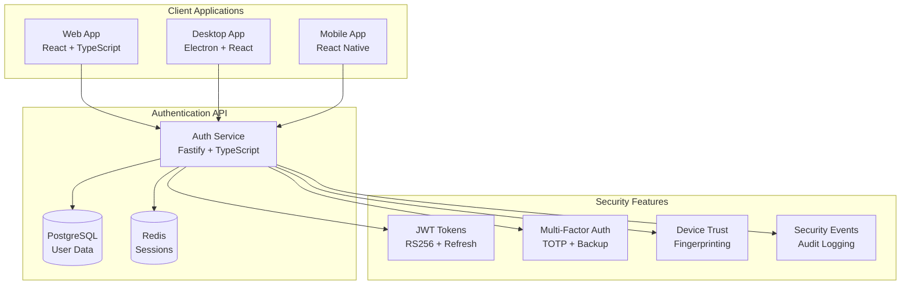

# JobSwipe Authentication Integration

## Overview

This directory contains comprehensive integration guides for implementing JobSwipe's enterprise-grade authentication system across different platforms and frameworks.

## Quick Start

Choose your integration guide based on your application type:

- **[Web Applications](./web-integration.md)** - React, TypeScript, modern web apps
- **[Desktop Applications](./desktop-integration.md)** - Electron apps with secure token storage

## Architecture Overview



## Core Features

### 🔐 Enterprise Security
- **JWT with RS256**: Secure token signing with key rotation
- **Multi-Factor Authentication**: TOTP, backup codes, device trust
- **Session Management**: Redis-based session storage and monitoring
- **Rate Limiting**: Comprehensive protection against abuse
- **Audit Logging**: Complete security event tracking

### 🔄 Token Management
- **Automatic Refresh**: Seamless token renewal
- **Secure Storage**: OS keychain integration for desktop apps
- **Cross-Platform**: Consistent experience across all platforms
- **Device Registration**: Unique device identification and trust

### 🎯 Developer Experience
- **TypeScript First**: Full type safety and IntelliSense
- **Zod Validation**: Runtime type validation for all data
- **Comprehensive Testing**: Unit, integration, and E2E tests
- **Error Handling**: Robust error handling with user-friendly messages

## Integration Patterns

### 1. Web Application Flow

```typescript
// Initialize auth client
const authClient = new AuthClient('https://api.jobswipe.io');

// Register user
const response = await authClient.register({
  email: 'user@example.com',
  password: 'SecurePassword123!',
  firstName: 'John',
  lastName: 'Doe',
  source: 'web',
  termsAccepted: true,
  privacyAccepted: true
});

// Login user
const loginResponse = await authClient.login({
  email: 'user@example.com',
  password: 'SecurePassword123!',
  source: 'web'
});

// Access protected resources
const profile = await authClient.getProfile();
```

### 2. Desktop Application Flow

```typescript
// Initialize auth service
const authService = AuthService.getInstance();

// Start authentication flow
await authService.startAuthentication();

// Handle token exchange (from web browser)
await authService.handleTokenExchange(exchangeToken);

// Access current user
const user = authService.getUser();
const accessToken = authService.getAccessToken();
```

### 3. React Context Integration

```typescript
// Web application context
const { user, login, logout, isAuthenticated } = useAuth();

// Desktop application context
const { authState, startAuthentication, logout } = useElectronAuth();
```

## Security Best Practices

### 1. Token Storage

| Platform | Primary Method | Fallback | Security Level |
|----------|----------------|----------|----------------|
| Web | HTTP-only cookies | localStorage | Medium |
| Desktop | OS Keychain | Encrypted storage | High |
| Mobile | Keychain/Keystore | Encrypted storage | High |

### 2. Authentication Flow

1. **Registration/Login**: User provides credentials
2. **Token Generation**: Server generates JWT access/refresh tokens
3. **Secure Storage**: Tokens stored securely on client
4. **API Requests**: Access token included in Authorization header
5. **Token Refresh**: Automatic refresh before expiration
6. **Logout**: Tokens revoked on server and cleared locally

### 3. Error Handling

```typescript
try {
  await authClient.login(credentials);
} catch (error) {
  if (error.response?.status === 401) {
    // Invalid credentials
    showError('Invalid email or password');
  } else if (error.response?.status === 429) {
    // Rate limited
    showError('Too many attempts. Please try again later.');
  } else {
    // Network or server error
    showError('Authentication failed. Please try again.');
  }
}
```

## Environment Setup

### Development Environment

```env
# API Configuration
REACT_APP_API_BASE_URL=http://localhost:3000
REACT_APP_ENVIRONMENT=development

# Authentication
REACT_APP_AUTH_TOKEN_KEY=jobswipe_auth_token
REACT_APP_REFRESH_TOKEN_KEY=jobswipe_refresh_token

# Security
REACT_APP_ENABLE_DEBUG_LOGS=true
```

### Production Environment

```env
# API Configuration
REACT_APP_API_BASE_URL=https://api.jobswipe.io
REACT_APP_ENVIRONMENT=production

# Authentication
REACT_APP_AUTH_TOKEN_KEY=jobswipe_auth_token
REACT_APP_REFRESH_TOKEN_KEY=jobswipe_refresh_token

# Security
REACT_APP_ENABLE_DEBUG_LOGS=false
```

## Common Integration Patterns

### 1. Route Protection

```typescript
// Web application
<Route
  path="/dashboard"
  element={
    <ProtectedRoute>
      <Dashboard />
    </ProtectedRoute>
  }
/>

// Desktop application
const AppContent = () => {
  const { authState } = useElectronAuth();
  
  if (!authState.isAuthenticated) {
    return <AuthenticationScreen />;
  }
  
  return <Dashboard />;
};
```

### 2. API Client Setup

```typescript
// Axios interceptor for token handling
axiosInstance.interceptors.request.use((config) => {
  const token = getAccessToken();
  if (token) {
    config.headers.Authorization = `Bearer ${token}`;
  }
  return config;
});

// Response interceptor for token refresh
axiosInstance.interceptors.response.use(
  (response) => response,
  async (error) => {
    if (error.response?.status === 401) {
      const refreshed = await refreshToken();
      if (refreshed) {
        return axiosInstance(error.config);
      }
    }
    return Promise.reject(error);
  }
);
```

### 3. State Management

```typescript
// Auth state interface
interface AuthState {
  isAuthenticated: boolean;
  isLoading: boolean;
  user: User | null;
  session: Session | null;
  error: string | null;
}

// Auth context value
interface AuthContextValue {
  authState: AuthState;
  login: (credentials: LoginCredentials) => Promise<void>;
  register: (userData: RegisterData) => Promise<void>;
  logout: () => Promise<void>;
  refreshToken: () => Promise<boolean>;
  clearError: () => void;
}
```

## Testing Strategy

### 1. Unit Tests

```typescript
// Mock auth service
const mockAuthService = {
  login: jest.fn(),
  logout: jest.fn(),
  getUser: jest.fn(),
  isAuthenticated: jest.fn()
};

// Test authentication flow
describe('AuthService', () => {
  it('should authenticate user successfully', async () => {
    mockAuthService.login.mockResolvedValue({
      success: true,
      user: mockUser,
      tokens: mockTokens
    });
    
    const result = await authService.login(credentials);
    expect(result.success).toBe(true);
    expect(mockAuthService.login).toHaveBeenCalledWith(credentials);
  });
});
```

### 2. Integration Tests

```typescript
// Test API integration
describe('Auth API Integration', () => {
  it('should handle login flow end-to-end', async () => {
    const response = await request(app)
      .post('/auth/login')
      .send(validCredentials)
      .expect(200);
    
    expect(response.body.success).toBe(true);
    expect(response.body.tokens.accessToken).toBeDefined();
  });
});
```

### 3. E2E Tests

```typescript
// Test complete authentication flow
describe('Authentication Flow', () => {
  it('should complete login flow', async () => {
    await page.goto('/login');
    await page.fill('[data-testid="email"]', 'user@example.com');
    await page.fill('[data-testid="password"]', 'password123');
    await page.click('[data-testid="login-button"]');
    
    await expect(page).toHaveURL('/dashboard');
    await expect(page.locator('[data-testid="user-menu"]')).toBeVisible();
  });
});
```

## Performance Optimization

### 1. Token Refresh Strategy

```typescript
// Refresh token before expiration
const scheduleTokenRefresh = (expiresIn: number) => {
  const refreshTime = (expiresIn - 300) * 1000; // 5 minutes before expiry
  
  setTimeout(async () => {
    try {
      await refreshToken();
      scheduleTokenRefresh(newExpiresIn);
    } catch (error) {
      console.error('Token refresh failed:', error);
      logout();
    }
  }, refreshTime);
};
```

### 2. Lazy Loading

```typescript
// Lazy load auth components
const LazyLoginForm = lazy(() => import('./components/LoginForm'));
const LazyRegisterForm = lazy(() => import('./components/RegisterForm'));

// Use with Suspense
<Suspense fallback={<LoadingSpinner />}>
  <LazyLoginForm />
</Suspense>
```

### 3. Memoization

```typescript
// Memoize auth context value
const authContextValue = useMemo(() => ({
  authState,
  login,
  register,
  logout,
  refreshToken,
  clearError
}), [authState, login, register, logout, refreshToken, clearError]);
```

## Monitoring and Analytics

### 1. Authentication Events

```typescript
// Track authentication events
const trackAuthEvent = (event: string, data?: any) => {
  analytics.track('auth_event', {
    event,
    timestamp: new Date().toISOString(),
    user_id: authState.user?.id,
    ...data
  });
};

// Usage
trackAuthEvent('login_success', { method: 'password' });
trackAuthEvent('login_failure', { error: 'invalid_credentials' });
trackAuthEvent('logout', { session_duration: sessionDuration });
```

### 2. Error Tracking

```typescript
// Global error handler
const handleAuthError = (error: Error, context: string) => {
  console.error(`Auth Error [${context}]:`, error);
  
  // Send to error tracking service
  errorTracker.captureException(error, {
    tags: { context, component: 'auth' },
    user: authState.user,
    extra: { timestamp: new Date().toISOString() }
  });
};
```

## Migration Guide

### From Version 1.x to 2.x

```typescript
// Old API
const authClient = new AuthClient();
await authClient.authenticate(email, password);

// New API
const authClient = new AuthClient();
await authClient.login({ email, password, source: 'web' });
```

### Breaking Changes

1. **Login Method**: Changed from `authenticate()` to `login()`
2. **Response Format**: Standardized response structure
3. **Error Handling**: New error codes and messages
4. **Token Format**: Updated JWT payload structure

## Support and Resources

### Documentation
- [API Reference](../api/authentication.md)
- [Web Integration Guide](./web-integration.md)
- [Desktop Integration Guide](./desktop-integration.md)

### Community
- [GitHub Issues](https://github.com/jobswipe/auth/issues)
- [Stack Overflow](https://stackoverflow.com/questions/tagged/jobswipe-auth)
- [Discord Community](https://discord.gg/jobswipe)

### Professional Support
- Email: [support@jobswipe.io](mailto:support@jobswipe.io)
- Enterprise Support: [enterprise@jobswipe.io](mailto:enterprise@jobswipe.io)

---

For detailed implementation instructions, please refer to the specific integration guides for your platform.